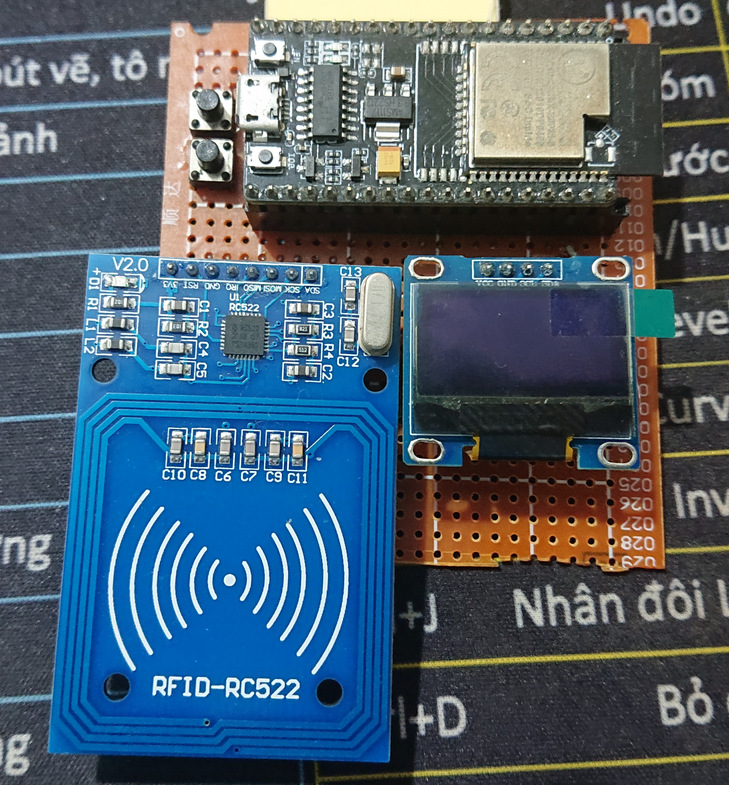

# ATTENDANCE SYSTEM USE ESP32 AND RFID
The project use Arduino Framework to programming for ESP32. Components of the circuit has ESP32 NodeMCU-32S as the client to communicate with server. ESP32 will read ID from MIFARE 1K card and make HTTP request to a PHP script to store data into a MySQL database. 000webhost is free webserver that help we manage, upload PHP script, manage and edit database, and hosting website. 

The project has two main tasks. Firstly, checkin function that help we check does the id exist in database, the id is from id of MIFARE card, and second is write new data to database. 

